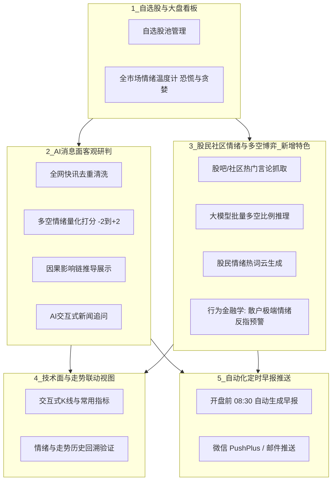
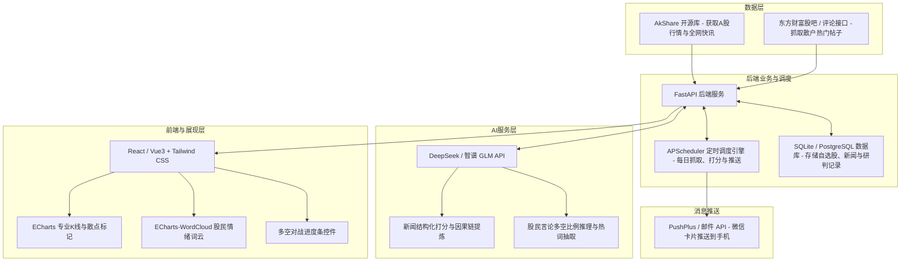

# 【项目构想与技术方案】FinPulse 智能股票舆情与辅助决策平台

> **写在前面给队友们的话**：  
> 这份文档旨在把我们的软工选题构想、**核心功能设计、实际界面长什么样、底层怎么做、以及每个人负责什么**清楚地讲透。  
> 整体思路是做一款**“自选股专属的 AI 投资秘书”**：不仅帮股民过滤 90% 的垃圾新闻噪音，利用大模型提炼核心逻辑并量化情绪，**更能深度挖掘东方财富股吧等社区的“散户真实多空情绪”，利用行为金融学的“反指预警”辅助决策**，同时结合 K 线走势进行直观联动展示。  
> **核心难点（行情、社区互动和自然语言处理）均有现成的开源库支持，开发门槛适中、界面视觉冲击力强、软工代码量与分工非常清晰，极易拿高分。**

---

## 一、 这个软件到底解决什么痛点？

平时炒股或理财看盘时，最大的痛苦就是：
1. **垃圾新闻太多**：自媒体洗稿、标题党、广告软文满天飞，有效信息极少。
2. **长篇大论读不完**：几千字的行业研报或公告，普通人根本没时间看，更抓不住核心传导链。
3. **散户情绪“摸不透”**：不知道当前市场上大众散户到底是在恐慌割肉还是在盲目追涨，经常“一买就跌、一卖就涨”。
4. **主观感觉不客观**：不知道历史上类似利好发生时，股价未来 3~5 天到底涨了还是跌了。

**我们的产品形态**：
用户添加几只自选股（例如：`贵州茅台 600519`、`宁德时代 300750`），平台自动：
1. 拉取全网最新公告与快讯，清洗去重后交给大模型，输出**“客观舆情打分（-2 到 +2） + 一句话核心结论 + 因果链条分析”**；
2. 抓取东方财富股吧等热门讨论，大模型统计**“散户看多看空比例”**，绘制**“散户多空对战条”与“情绪词云”**；
3. 结合行为金融学，提供**“散户情绪逆向预警（狂热防顶/冰点防割）”**；
4. 在每个交易日开盘前为用户推送一份排版精美的**《今日自选股早报》**。

---

## 二、 核心功能设计全景



### 1. 自选股管理与全市场情绪“温度计”
* **自选股池**：支持通过代码或名称拼音模糊搜索，快速加自选，展示现价、涨跌幅、PE、换手率。
* **全市场情绪温度计（大盘宏观）**：
  * 抓取两市上涨/下跌家数比、全市场成交量、涨停破板率、北向资金净流入。
  * 合成一个 **0~100 的“市场情绪温度计”**（极度恐慌、悲观、中性、狂热），并在首页以速度表仪表盘形式展示。

### 2. 权威消息面 AI 客观研判流
* **去重清洗**：自动对全网同质快讯进行 SimHash 聚类去重，过滤垃圾广告。
* **量化情绪评分**：大模型对每条核心新闻进行客观打标：
  * `+2 强利好` / `+1 弱利好` / `0 中性` / `-1 弱利空` / `-2 强利空`。
* **逻辑传导链拆解（避免纯黑盒）**：
  * *示例*：贵州茅台批价波动公告。
  * *AI 输出链条*：`飞天批价微调 -> 渠道毛利短期压缩 -> 市场情绪短期偏向谨慎 -> 中长期看品牌护城河未变`。
* **一键追问（AI 对话）**：支持在新闻卡片下追问（例如：“*这条政策会对同板块的五粮液有何影响？*”），大模型即时结构化解答。

### 3. 【核心特色模块】股民社区“散户情绪”与多空博弈洞察
* **股吧热门言论抓取**：抓取东方财富股吧、雪球等针对该个股当天讨论度最高的 Top 30~50 条帖子。
* **大模型批量多空比例推理**：
  * 将热门帖子批量送入大模型，AI 自动提炼并统计出：**看多比例（%） vs 看空比例（%） vs 观望比例（%）**。
  * **加权指数**：结合帖子的阅读量和回复数进行权重加乘，防止水军刷帖干扰。
* **散户多空对战进度条（Bull vs Bear Ratio）**：
  * 直观展示多空阵营对抗（如：`🐂 看多 68% vs 看空 32% 🐻`）。
* **股民情绪热词云（Word Cloud）**：
  * 提炼散户讨论的高频情绪词（“加仓”、“跌停”、“洗盘”、“解套”、“利好出尽”），红涨绿跌高亮展示。
* **行为金融学杀手锏——散户反指逆向预警（逆向投资逻辑，答辩加分项）**：
  * **散户极度亢奋时（看多率 > 85%）**：触发【⚠️ 情绪过热预警：散户盲目追高，警惕主力高位兑现/见顶回调】；
  * **散户极度悲观时（看空率 > 80%）**：触发【💡 情绪冰点信号：恐慌盘基本割肉出局，短期下行势能衰竭，关注超跌反弹】。

### 4. 技术面与走势联动视图（视觉亮点）
* **K 线图表与指标**：集成专业级 K 线图（日 K、周 K，支持 MA5/MA20 均线、MACD、RSI 指标切换）。
* **舆情-行情回溯验证面板（答辩必杀技）**：
  * 在 K 线图的时间轴上，把重大新闻发生的日子用散点打标（红点利好、绿点利空）。
  * 点击散点可查看当时的新闻、AI 情绪与散户看多率，直观对比**“AI 评定利好后，未来 3~5 天股价真实走势”**，透明可信。

### 5. 定时早报与微信推送
* 每天早晨 8:30（开盘前一小时），系统自动聚合自选股昨夜至今晨全网消息面与股民讨论热点。
* 自动排版成一张精美的 HTML/Markdown 早报卡片，通过 **微信（PushPlus / Server酱）** 或邮件发送到用户手机。

---

## 三、 前端界面布局构想（UI / UX 假想效果）

界面采用现代金融科技常用的 **暗黑主题（Dark Mode）**，专业且高级：

```
+--------------------------------------------------------------------------------------------------------------------+
|  FinPulse 智脉股析         [搜索代码: 600519/茅台]   [全市场情绪: 68 偏向乐观 (仪表盘)]                  用户: hesiqi |
+--------------------------------------------------------------------------------------------------------------------+
| 左侧：自选股列表        | 中间：行情走势与技术指标区                       | 右侧：AI舆情流水线 & 股民情绪洞察                  |
|                        |                                                 |                                                  |
| 1. 贵州茅台 600519     | [ 贵州茅台 1680.00  +1.25%  换手 0.45% ]         | === 【股民社区多空博弈】 (东方财富股吧数据) ====== |
|    1680.00  +1.25%     |                                                 | [ 🐂 看多 68% ================= | ===== 32% 🐻 ] |
|                        |  K 线走势图 (日K / MA / MACD)                    | ⚠️ 散户情绪偏热: 讨论热度居高，注意冲高回落风险   |
| 2. 宁德时代 300750     |   /\    /\                                      | 情绪词云: [加仓] [海外大增] [主力洗盘] [飞天批价] |
|    250.30   -0.80%     |  /  \  /  \    ● [AI利好标注]                    |                                                  |
|                        | /    \/    \--/                                 | === 【AI 消息面研判流】 (权威新闻去重) =========== |
| 3. 中芯国际 688981     |                                                 | 1. [强利好 +2] 茅台海外销量同比大增 35%          |
|    85.20    +3.40%     | ----------------------------------------------- |    - 传导链: 拓展海外市场 -> 增量营收 -> 估值提升 |
|                        | 【历史走势回溯验证】过去30天AI研判与后续走势:     |    - 查看原新闻 | [向AI追问细节]                  |
| [+ 添加自选股]         | 走势契合度: 74.2%  (胜率良好)                   | 2. [弱利空 -1] 原材料成本波动微调                 |
| [全屏多图切换]         |                                                 | ------------------------------------------------ |
|                        |                                                 | [微信订阅早报] [导出今日自选股诊断 PDF]          |
+--------------------------------------------------------------------------------------------------------------------+
```

---

## 四、 技术实现方案与选型（怎么落地？难不难？）

我们不重复造轮子，充分复用成熟开源项目：



### 1. 数据来源：省心省力的开源生态
* **行情与新闻**：Python 开源金融库 **`AkShare`**（直接调用接口拿 A 股实时行情、K 线、东方财富/新浪财经快讯），免除被封 IP 的痛苦。
* **股吧言论**：通过 `AkShare` 的互动平台接口或轻量抓取东方财富个股吧网页的前 50 条标题与互动量。

### 2. AI 研判：结构化输出的 DeepSeek API
* **新闻研判 Prompt**：输出新闻核心摘要、情绪打分（-2 到 +2）和因果链条。
* **散户多空推理 Prompt**：
  ```
  【输入】：关于某股票的 30 条股吧讨论帖子标题列表
  【任务】：
  1. 统计股民倾向：看多比例、看空比例、观望比例；
  2. 提取 5 个最集中的高频情绪关键词；
  3. 判断是否存在“群体极度亢奋”或“恐慌踩踏”极端情绪。
  【输出格式】：严谨 JSON 对象
  ```
* **成本**：DeepSeek API 百万 Token 仅需几毛钱，日均开销几乎可以忽略不计。

### 3. 后端服务与自动化：FastAPI + APScheduler
* **FastAPI**：异步高性能，自动生成 Swagger 接口文档，前后端联调效率极高。
* **定时引擎**：使用轻量级的 `APScheduler`，在开盘前自动运行分析流水线，省去复杂的分布式调度。

### 4. 前端展示：Vue3 / React + ECharts
* **K 线图**：ECharts `candlestick` 配置，自带缩放、MA 均线、MACD 指标切换。
* **多空条与词云**：`echarts-wordcloud` 渲染词云，CSS Flex 制作动态多空对战进度条。

### 5. 数据库设计：完全契合课程大纲
按照软工大纲标准建立规范表结构（严格包含创建/更新/软删除审计字段）：
* `SYS_USER`（用户账号表）
* `USER_STOCK`（自选股关联表）
* `STOCK_NEWS`（新闻快讯去重表）
* `STOCK_COMMUNITY_SENTIMENT`（股吧多空比例与词云数据表）
* `AI_ANALYSIS_LOG`（AI 研判与因果链记录表）
* 字段命名全大写（如 `STOCK_CODE`, `SENTIMENT_SCORE`, `BULL_RATIO`, `CREATE_TIME`, `FLAG`）。

---

## 五、 为什么这个选题最容易让大家拿高分？

1. **功能丰富、视觉冲击力强**：
   * 集合了 **“专业 K 线 + AI 新闻研判 + 散户多空条 + 情绪词云 + 微信推送”**，答辩现场直接投屏演示，比普通的管理系统高级很多。
2. **巧妙引入“行为金融学（反指预警）”**：
   * 避开了死板的“预测涨跌”，而是通过散户极端情绪进行“逆向预警”，理论站得住脚，极具学术探索深度。
3. **5分真实用户反馈极易拿满**：
   * 部署到公网后，发给身边的同学或股民朋友试用，订阅微信早报，问卷很容易收集满。
4. **分工均衡，代码量扎实**：
   * 4 人团队职责清晰，不存在某人没事干或某人单打独斗的情况。

---

## 六、 团队 4 人分工与职责建议（大家可以认领）

| 角色 | 核心任务与职责 | 核心产出物 |
| :--- | :--- | :--- |
| **组员 A（后端架构 & 量化算法）** | **实打实核心研发**：负责 FastAPI 业务架构与规范数据库 DDL；编写 **MA/MACD/RSI/KDJ 量化指标计算库** 与 **K 线经典形态（金叉死叉/放量突破）识别算法**；开发 **全市场宏观“恐慌与贪婪温度计”加权模型**；开发股票代码拼音检索索引与自选股投资组合风险诊断 API。 | 后端 API 服务、技术指标与形态识别算法源码、大盘情绪计算脚本、规范数据库 DDL |
| **组员 B（权威资讯 & 大模型）** | 负责 AkShare 权威资讯与公告接入、SimHash 文本去重算法、DeepSeek Prompt 调优与因果链提炼、AI 追问接口。 | 数据清洗模块、大模型研判算法、AI 追问源码 |
| **组员 C（前端全栈 & 可视化）** | 负责墨刀原型设计、Web 交互界面开发、ECharts K 线图与指标、散户多空对战条与高频情绪词云。 | 墨刀原型、前端完整代码、高颜值暗黑 UI |
| **组员 D（社区挖掘 & 定时中枢）** | **实打实核心研发**：负责股吧热门帖子爬虫与清洗、散户加权多空比计算模型、APScheduler 早报引擎与微信推送、走势回溯验证算法。<br>*(后期统筹测试、轻量部署与PPT)* | 股吧爬虫与多空算法、定时微信推送脚本、回溯算法代码、测试报告与PPT |

---

## 七、 接下来需要做的事（第一周）

1. **队友碰头**：大家看看本方案，确认角色意向与功能细节。
2. **Gitee 建仓**：建立小组仓库，初始化项目目录结构与分支权限。
3. **完成第一次作业**：
   * 根据本文档整理出 **头脑风暴会议纪要**；
   * 绘制系统功能 **思维导图 (Mindmap)**；
   * 整理第一版 **NABCD 分析表** 提交给老师。
