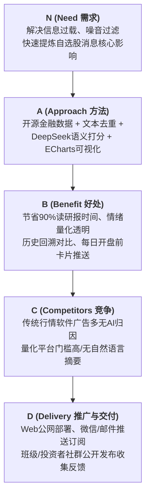
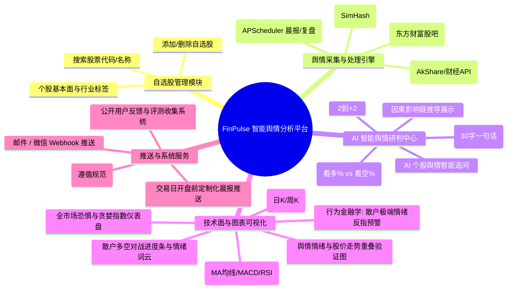
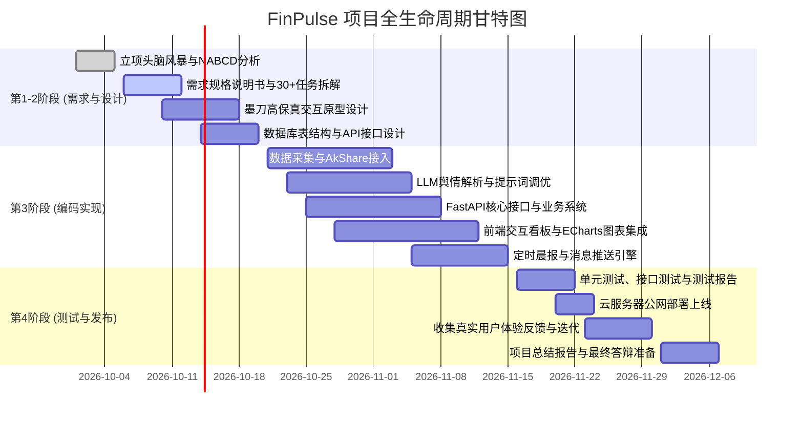

# 《软件工程实践》项目选题与立项报告

> **项目名称**：FinPulse（智脉股析）—— 基于大模型的股票舆情量化分析与辅助决策平台  
> **面向课程**：《软件工程实践》（教材：《智能软件工程》 / 《软件工程 3.0》）  
> **项目定位**：智能化金融信息聚合、新闻情绪量化评级、技术面融合展示及自选股智能推送系统  
> **代码仓库**：`https://gitee.com/<team_id>/finpulse` (拟定)  
> **报告日期**：2026 年 9 月 30 日  

---

## 一、 项目背景与头脑风暴记录

### 1.1 选题背景与痛点观察
在当前的 A 股及资本市场中，散户投资者（或个人理财群体）在信息获取上常面临严重的“不对称”与“信息过载”：
1. **信息噪音巨大**：同一条政策或快讯在各大财经媒体、自媒体上被疯狂转载（洗稿、标题党、广告软文泛滥），有效信息密度极低。
2. **定性分析成本高**：阅读一份财报摘要、重大重组公告或行业研报往往需要 10~20 分钟专业分析，普通散户缺乏足够的时间和专业能力快速研判该事件的**直接影响链条**。
3. **缺乏量化跟踪手段**：散户对新闻的理解往往凭主观感觉，无法追溯“历史上利好消息发布后，次日/次周股价走势到底如何”，缺乏客观回溯数据支持。
4. **现有软件痛点**：传统股票 App（如东方财富、同花顺）新闻流信息繁杂且充斥大量广告，缺乏定制化的“自选股深度浓缩研报”与智能化推送。

### 1.2 团队头脑风暴记录 (Brainstorming Record)
* **参会人员**：项目组全体成员（拟 4 人）
* **讨论主题**：选定一个兼具 **AI 时代特色（符合软工 3.0 大纲）**、**具备实用价值** 且 **工作量扎实** 的全流程工程项目。
* **主要争议与决策过程**：
  * *争议点 1：要不要做“股价预测系统”？*  
    * **结论**：**不做！** 股市受宏观流动性、庄家博弈等复杂因素影响，直接预测次日涨跌不仅极其不准，答辩时易被评委质疑逻辑可信度与合规风险。系统定位调整为**“舆情客观情绪量化（-2 到 +2 分）+ 影响链条归因 + 历史走势相关性对比”**，辅助用户决策。
  * *争议点 2：爬虫会不会频繁失效？*  
    * **结论**：核心数据接入成熟可靠的开源金融库（如 **`AkShare`**），新闻爬虫采用多源降级策略，确保系统的持续稳定运行。
  * *争议点 3：工作量是否充足？*  
    * **结论**：涵盖“数据采集/清洗去重 -> LLM 批量异步处理 -> 数据库规范存储 -> Web 仪表盘可视化 -> 邮件/微信定时推送 -> 真实用户公网测试”全生命周期链路，完全满足软工大纲对代码量与分工的要求。

---

## 二、 NABCD 模型需求分析（课程核心要求）

### 1. N（Need - 真实需求）
* **即时降噪需求**：投资者需要只关注自己持仓（自选股）的高度相关消息，过滤掉 90% 的垃圾和重复水文。
* **深度归因需求**：投资者需要知道新闻背后的**“底层逻辑”**（为什么利好/利空、对主营业务有何传导影响）。
* **技术与消息面共振需求**：不仅看新闻，还要对照当前股价处于高位还是低位（均线、MACD 技术指标共振）。
* **自动化晨报需求**：在交易日开盘前（早 8:30）收到定制化的自选股简报，提前做好交易预案。

### 2. A（Approach - 独特解决方案）
* **数据采集与降噪清洗**：通过 `AkShare` 获取权威公告与财经新闻，使用 SimHash 算法进行文本相似度去重，按公司实体权重过滤。
* **大模型结构化研判**：采用轻量高性价比的中文大模型（如 DeepSeek-V3 / 智谱 GLM），输出严格的 JSON 格式：
  * 情绪评分（-2 强利空、-1 弱利空、0 中性、+1 弱利好、+2 强利好）
  * 核心论点（一句话精炼，不超过 30 字）
  * 影响逻辑链（如：`原料涨价 -> 成本承压 -> 净利短期承压`）
* **全栈架构与图表**：FastAPI 后端 + React/Vue3 + ECharts，提供 K 线技术指标与舆情波动的联动视图。
* **轻量自动化调度**：后台挂载 APScheduler 调度器，支持每日定时生成早报并通过 Webhook / 邮件推送到用户端。

### 3. B（Benefit - 核心用户收益）
* **极度省时**：每天只需浏览 2 分钟，即可掌握所有自选股昨日全网消息面核心。
* **情绪可量化，拒绝情绪用事**：提供清晰的数据图表，直观感知市场对该股的热度与多空态度。
* **回溯验证、透明可查**：提供“AI 历史研判 vs 后续股价真实表现”面板，透明公开，增强信任。

### 4. C（Competitors - 竞品对比与差异化优势）

| 对比维度 | 传统股票 App（同花顺/东财） | 财经论坛（雪球/股吧） | 商业量化终端（Wind/Choice） | **本项目（FinPulse）** |
| :--- | :--- | :--- | :--- | :--- |
| **信息密度** | 低（广告多、重复新闻泛滥） | 极低（情绪化发言、水贴多） | 极高，但过于繁重 | **高（精简、去重、无广告）** |
| **AI 深度解析** | 仅简单标签标注 | 无 | 部分研报总结，费用极昂贵 | **大模型影响链归因 + 情感打分** |
| **技术与消息融合** | 独立展示，无联动 | 散户主观发言 | 需编写脚本代码 | **K线与舆情波峰一体化直观联动** |
| **定制化推送** | 系统消息推送杂乱 | 无专属晨报定制 | 企业级部署 | **每日开盘前精美早报卡片送达** |
| **使用成本** | 免费但广告多 | 免费 | 每年数万元，门槛极高 | **开源、轻量、免费易部署** |

### 5. D（Delivery - 交付、部署与推广路径）
* **交付形式**：Web 在线响应式网站（适配 PC 端和手机端浏览器）。
* **公开发布（符合课程指标）**：
  1. 部署于公网云服务器（学生优惠云机）并配置域名。
  2. 开辟**“用户体验问卷反馈”**悬浮按钮，向班级同学、社群投资者公开发放试用，收集真实功能反馈与评分。
  3. 提供微信推送（Server酱/PushPlus）或邮件推送订阅体验。

---

## 三、 系统功能架构与思维导图 (Mindmap)

---

## 四、 核心功能特色与软工亮点（冲刺 90+ 分）

### 亮点 1：因果链条解析（拒绝黑盒）
AI 不仅给出一个“看涨”或“看跌”的单向结论，而是生成清晰的结构化逻辑链：
> **示例**：贵州茅台发布批发价波动公告  
> **AI 研判**：【弱利空（-1）】  
> **传导链条**：`批价微跌 -> 渠道利润收缩预期 -> 市场短期谨慎观望 -> 长期品牌基本盘稳固`  
> **辅助结论**：短期注意估值消化，中长期重点观察批价止跌企稳信号。

### 亮点 2：股民社区情绪挖掘与“散户反指逆向预警”
* **多空比例推理**：大模型批量扫描股吧热门言论，计算散户加权看多/看空比例，并在前端通过“多空对战进度条”与“高频情绪词云”呈现。
* **行为金融学逆向指标（学术深度亮点）**：
  * 当散户看多率超过 85% 极度狂热时，系统触发【⚠️ 情绪过热预警：谨防主力高位兑现/见顶】；
  * 当散户看空率超过 80% 极度恐慌时，系统触发【💡 情绪冰点信号：恐慌盘基本衰竭，关注超跌反弹】。

### 亮点 3：舆情情绪 vs 股价波动“回溯验证面板”
在 K 线图上，将历史上重大新闻公布当天的 AI 情绪打分打标在图表上。学生答辩展示时，可以一目了然地展示：“**系统在过去 30 天标记为强利好的 10 次事件中，有 7 次在随后 3 个交易日内走出上涨行情**”，极大增强说服力。

### 亮点 4：全市场情绪全景仪表盘
爬取全市场涨跌统计（上涨家数/下跌家数、涨停板炸板率、北向资金净流入），计算一个“**今日市场恐慌与贪婪温度计**”，让用户一进首页就能掌握大盘当前整体氛围。

---

## 五、 技术选型与规范契合

### 5.1 推荐技术栈
* **后端框架**：`Python 3.10+` + `FastAPI`（高性能异步 API 框架，天然适合 AI 和数据流交互）
* **数据库**：`SQLite`（开发与演示方便）或 `PostgreSQL`
* **定时任务**：`APScheduler`（轻量任务调度，负责定时抓取与早报生成）
* **金融数据源**：`AkShare` 开源金融数据接口库
* **大模型服务**：`DeepSeek-V3` / 智谱 GLM API（中文金融理解力极强，调用成本极低）
* **前端框架**：`React` / `Vue 3` + `Tailwind CSS` + `ECharts 5`
* **部署与运维**：Docker 容器化部署于 Linux 云服务器

### 5.2 数据库规范（严格遵照课程大纲规范）
按照《软件工程实践》大纲要求，所有数据库实体表均包含审计字段与全大写命名：
* `CREATE_BY`（创建人 VARCHAR）
* `CREATE_TIME`（创建时间 DATETIME）
* `UPDATE_BY`（最后更新人 VARCHAR）
* `UPDATE_TIME`（最后更新时间 DATETIME）
* `FLAG`（软删除/状态标记 CHAR(1)）
* 字段命名一律采用大写英文下划线，如 `STOCK_CODE`, `SENTIMENT_SCORE`, `NEWS_SUMMARY`。

---

## 六、 团队分工与细分任务规划（初拟）

按照课程要求的团队协作模式（4 人团队）：

### 组员职责划分
1. **组员 A（组长 / 架构师 & 后端）**：
   * 负责架构设计、数据库设计与规范化管理；
   * 开发用户管理、自选股管理模块、FastAPI 核心 API；
   * 协调 Gitee 协作流程（分支策略与 PR 审核）。
2. **组员 B（数据与 AI 算法工程师）**：
   * 负责 `AkShare` 金融快讯与行情数据的采集、清洗去重；
   * 负责大模型 Prompt 工程、结构化 JSON 输出解析与打分逻辑；
   * 负责定时调度器（APScheduler）及多渠道推送（邮件/微信）集成。
3. **组员 C（前端全栈开发工程师）**：
   * 使用墨刀完成原型设计与交互流程；
   * 负责 Web 前端界面构建（自选股列表、消息瀑布流、早报卡片）；
   * 负责 ECharts K线行情与情绪波峰散点图的高性能渲染。
4. **组员 D（质量保障与运维文档）**：
   * 编写功能与性能测试计划，编写自动化测试用例（pytest）；
   * 负责公网服务器 Docker 部署与持续集成；
   * 负责设计问卷收集真实用户反馈，产出规范化测试报告与结项汇报 PPT。

---

## 七、 总结

本选题紧密结合《软件工程实践》大纲对“智能化软件工程”的倡导，不仅具备极高的**实用价值与视觉表现力**，而且在软件工程层面具备完整清晰的**需求、架构、设计、编码、测试与真实用户反馈闭环**。该方案逻辑扎实、规避了金融预测的合规缺陷，是一个极具竞争力的满分冲刺选题。
