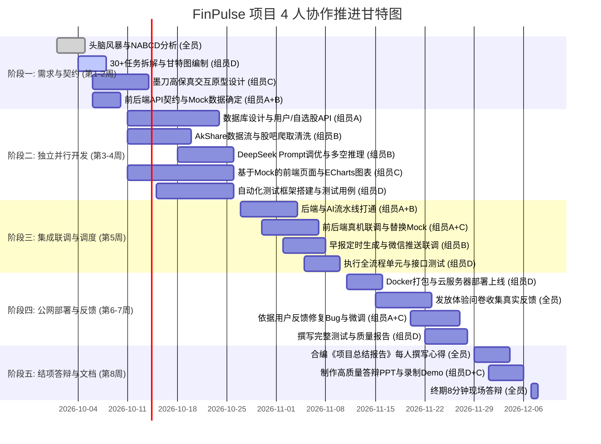

# 【团队分工与执行流水线】FinPulse 4人团队协作指南

> **目标**：杜绝“组员干等组员”、避免最后代码量不均，以“API 契约先行 + 敏捷流水线”模式高效推进，冲刺课程高分。

---

## 一、 团队角色与核心职责划分

| 角色 | 组员职责 | 核心模块与技术栈 | 考核产出物（Gitee Commit 依据） |
| :--- | :--- | :--- | :--- |
| **组员 A (后端架构 & 量化算法)** | **后端总控与技术面量化计算** 把控架构、量化指标引擎与形态识别 | - FastAPI 业务框架与规范化数据库 DDL - **技术指标量化算法（MA/MACD/RSI/KDJ 计算库）** - **K 线经典形态识别算法（金叉死叉/放量突破）** - **全市场宏观“恐慌与贪婪温度计”综合加权引擎** - 股票代码拼音检索索引与自选组合风险诊断 | 1. 技术指标与形态识别算法模块 2. 全市场恐慌贪婪指数计算脚本 3. 后端核心业务接口与数据库 DDL 4. OpenAPI 接口规范契约 |
| **组员 B (权威资讯 & AI 算法)** | **资讯管道与大模型研判** 权威资讯抓取、去重与LLM推理 | - `AkShare` 权威资讯与公告接入 - SimHash 文本相似度聚类去重算法 - DeepSeek 提示词调优与因果链提炼 - AI 交互式追问问答接口开发 | 1. 金融新闻抓取与去重模块 2. 大模型结构化研判算法 3. AI 追问交互 API 源码 |
| **组员 C (前端全栈 & 可视化)** | **交互原型与前端呈现** 高保真原型、暗黑看板、金融图表 | - 墨刀高保真可交互原型 - React / Vue3 + Tailwind 布局 - ECharts K线图与技术指标（MA/MACD） - 散户多空进度条与高频词云组件 | 1. 墨刀可交互原型链接与截图 2. 前端工程完整源代码 3. 现代化响应式暗黑金融 UI |
| **组员 D (社区情绪 & 定时中枢)** | **散户情绪挖掘、推送与回溯** 负责股吧挖掘、多空算法、推送中枢 | - 东方财富股吧热门帖子爬取与清洗 - 散户加权多空比例推断算法 - APScheduler 早报定时器与微信推送 - 历史走势回溯验证分析算法 *(后期统筹测试、轻量部署与PPT)* | 1. 股吧爬虫与多空加权算法模块 2. 定时早报引擎与微信推送脚本 3. 历史回溯走势分析算法代码 4. 自动化测试脚本与答辩 PPT |

---

## 二、 5 阶段工作执行顺序（怎么推进不卡壳？）

---

## 三、 保证高效协同的 3 项铁律

1. **契约先行（Mock 解耦）**：
   * 第一阶段结束后，组员 A 产出 Swagger 文档并提供 Mock 数据。组员 C 拿 Mock 数据直接切入前端编码，绝不需要等待组员 A 或组员 B 写完后端。
2. **规范化分支管理（Gitee）**：
   * `main` 分支保持随时可部署状态；
   * 每位组员在自己的 `feature-<name>` 分支上开发，通过 PR 合并入 `dev` 分支，由组员 A Code Review，避免代码冲突。
3. **真实用户反馈提前锁定（稳拿 5 分）**：
   * 系统在第 6 周末必须具备基础可用性，组员 D 第一时间挂上公网域名并收集问卷。
